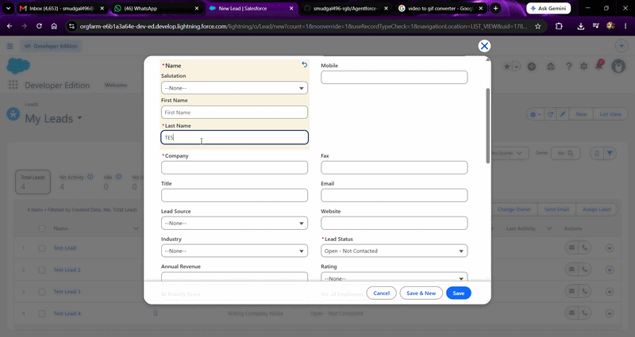

# Lead AI Triage — Agentforce-Pattern Custom Action

An AI-driven lead scoring agent built on Salesforce, using a custom Apex Invocable Action wired to Google's Gemini API. Designed to plug directly into Salesforce's Agentforce Action framework; demonstrated here via a Record-Triggered Flow due to Developer Edition licensing limits on the build environment.

## What it does

When a new Lead is created in Salesforce:
1. A Record-Triggered Flow fires asynchronously (required for any Flow making an external callout).
2. The Flow invokes a custom Apex Action (`LeadTriageAction.triageLeads`).
3. That action builds a structured prompt from the Lead's Company, Industry, Lead Source, and Description, and calls Google's Gemini API via a Named Credential.
4. The model returns a strict-JSON triage decision — a priority tier (Hot/Warm/Cold) and a short rationale.
5. The Lead record is updated automatically with the result — no manual intervention required.

## Demo



## Architecture

```
Lead created
   → Record-Triggered Flow (async path)
      → LeadTriageAction.triageLeads() [Apex Invocable Method]
         → GoogleService.callClaude() [HTTP callout via Named Credential]
            → Gemini API (gemini-3-flash-preview)
         ← structured JSON response
      ← Lead record updated: AI_Priority_Score__c, AI_Rationale__c, AI_Last_Run__c
```

## Why an Invocable Method, not hardcoded logic

The core triage logic lives in a Salesforce `@InvocableMethod`, not inline in the Flow or a trigger. This is deliberate: an Invocable Method is the same interface Agentforce's Agent Builder expects for custom Actions. The Apex code required zero changes between "called from a Flow" and "callable from Agent Builder" — only the orchestration layer differs. See [Design Notes](#design-notes) below for why Flow was used instead of native Agentforce here.

## Setup

1. **Salesforce org** — requires a standard Developer Edition (not Starter Edition — Apex is not supported on Starter).
2. **Custom fields on Lead:**
   - `AI_Priority_Score__c` (Picklist: Hot, Warm, Cold)
   - `AI_Rationale__c` (Long Text Area, 500 chars)
   - `AI_Last_Run__c` (Date/Time)
3. **Gemini API key** — free tier via [Google AI Studio](https://aistudio.google.com), no billing required.
4. **Named Credential** — `Google_API`, pointing to `https://generativelanguage.googleapis.com`, with a custom header `x-goog-api-key` set to your Gemini key. See `/docs` (or ask) for full step-by-step External Credential + Principal Access configuration — this took several iterations to get right (see Known Issues below) and is worth doing carefully.
5. Deploy:
   ```
   sf project deploy start --source-dir force-app
   ```
6. Build and activate the Record-Triggered Flow on Lead (Create trigger, async path required — see Design Notes).

## Design notes

- **Why Flow instead of native Agentforce Agent Builder:** the development org used for this project (Developer Edition) does not include an Agentforce license — "Purchase required" appears when attempting to enable Agent Builder. The Apex Invocable Method pattern was deliberately chosen so this project could demonstrate the identical custom-action design Agentforce expects, without requiring a licensed org. A production deployment on an Agentforce-licensed org would attach this same `LeadTriageAction` class directly as an Agent Action instead of a Flow.
- **Why an async Flow path, specifically:** Salesforce blocks HTTP callouts from the same transaction as uncommitted DML — since a newly created Lead's own insert is itself uncommitted work at the moment a "Run Immediately" Flow path would fire, the callout fails with `You have uncommitted work pending`. The async path defers execution until after the triggering transaction commits, which is a hard platform requirement for any Flow doing external callouts, not just a performance choice.
- **Why Gemini instead of Claude:** originally built and tested against Claude's API. Switched to Gemini's free tier partway through development to avoid a billing dependency on a portfolio project. See `PROMPT_DESIGN.md` for the full note on what did and didn't change in that migration.

## Known issues encountered during development (kept intentionally, not scrubbed)

- Early Named Credential setup duplicated auth headers across both the External Credential Principal and the Named Credential's own Custom Headers section, causing a silent auth failure. Resolved by keeping headers in exactly one place (Named Credential Custom Headers).
- Free-tier Gemini model names are unstable — two model versions used during development (`gemini-2.5-flash`, `gemini-2.5-flash-lite`) were deprecated for new API keys mid-project. Final version targets `gemini-3-flash-preview`, confirmed live via direct testing in AI Studio rather than trusting documentation alone.
- `LIMIT 1` in early manual test scripts, with no `ORDER BY`, non-deterministically selected among multiple Lead records in the org — a reminder that "it worked in my test" and "it updated the record I meant to update" are different claims.

## Tech stack

Apex · Salesforce Flow (async) · Named Credentials / External Credentials · Google Gemini API · Salesforce CLI

## License

MIT
